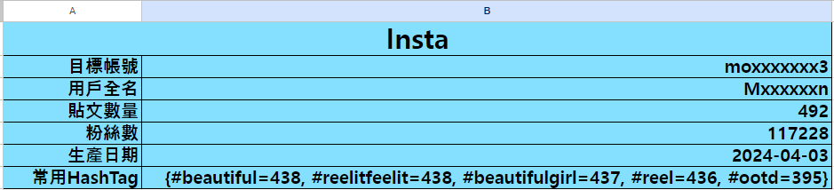
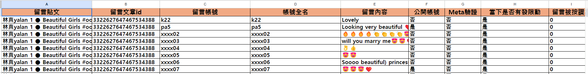
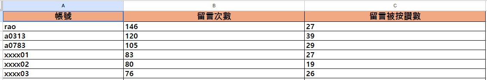
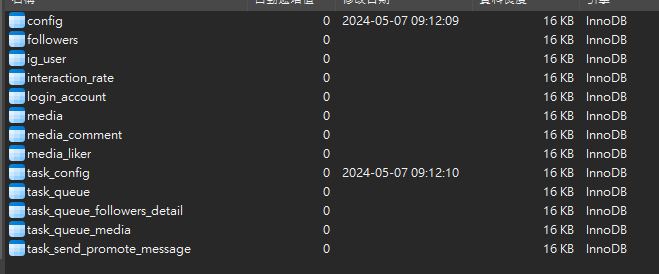
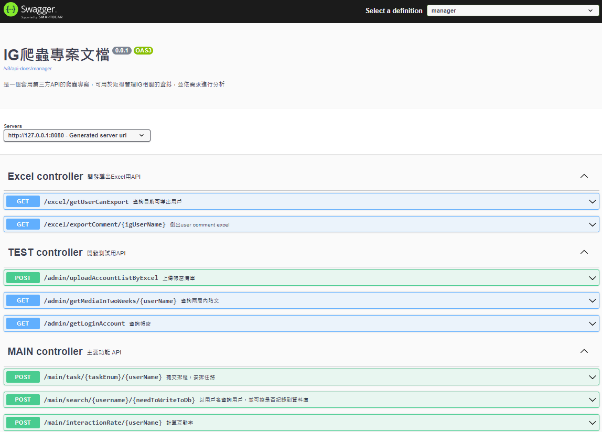

<p align="center"></p>
<p align="center">
  
  
  
  
</p>

<p align="center">
  
  
  
</p>

# Easy-Insta
**一個自動化的IG爬蟲Web後端服務**

## 需求
此專案使用以下技術
* JDK 17
* SpringBoot 2.7
* Gradle 8.6
* Lombok 1.18.20
* MySql 8.0.36
* EasyExcel 3.1.1
* Apache POI 5.2.3
* Selenium 4.19.1
* instagram4j
(forked and modified from https://github.com/instagram4j/instagram4j)

## 功能

### 透過BrightDataProxy + Instagram4j API
- [x] 登入
- [x] 登出
- [x] 爬取帳號追蹤者(API call)
- [x] 爬取特定帳號貼文(API call)
- [x] 爬取特定貼文留言(API call)
- [x] 爬取特定貼文按讚者(API call)

### 透過Selenium
- [x] 根據API call取得的追蹤者資訊，進一步取得追蹤者的發文數/追蹤者數量/追蹤人數
- [x] 傳送推廣訊息給特定用戶(自訊習功能內>新增訊息進行傳送)
- [x] 分享影片及傳送訊息給特定用戶(自貼文內進行分享)

### 透過EasyExcel
- [x] 批量匯入登入用帳密

### 透過Apache POI
- [x] 批量匯出API call取得的貼文留言/留言者

**以上功能皆可藉由swagger觸發，無前端畫面**

## 取得留言報告





## 安裝

以下將會引導你如何安裝此專案到你的電腦上。

1. 自官網文檔安裝mysql 8
   https://dev.mysql.com/downloads/mysql/
2. 執行專案內crawler.sql文件
   (路徑:src/main/resources/sql/crawler_ig.sql)
3. 確認是否已成功新增
   
4. 將資料庫連線資訊填入application.properties的
   (spring.datasource.url/username/password)
   (路徑:src/main/resources/application.properties)
5. 以IDE啟動服務，或以gradle打包後使用java -jar 啟動皆可


### 開啟專案

在瀏覽器網址列輸入以下即可看到畫面

```bash
http://127.0.0.1:8080/swagger-ui/index.html
```



## 致謝

-   [Instagram 上限參考](https://www.linkedin.com/pulse/stay-within-boundaries-complete-breakdown-instagrams-cmscc/)
- [Instagram 上限參考2](https://socialpros.co/instagram-daily-limits/#:~:text=Instagram's%20Daily%20Limits%20%E2%80%93%20Like,than%2030%20likes%20per%20hour)
-   [Meta API Policies](https://developers.facebook.com/devpolicy/)

## 第三方 Licenses

This project includes software from third-party libraries which are licensed under their own respective open-source licenses. Please see the `LICENSES` folder in the project directory for the license copies.

- `instagram4j`: Licensed under the Apache License, Version 2.0. See `licenses/instagram4j-lib-Apache-2.0.txt` for more details.
